# Argo Rollouts
この章では、Kubernetes上でプログレッシブデリバリーを可能とするデプロイツールであるArgo Rolloutsについて紹介し、導入します。

## プログレッシブデリバリーについて
プログレッシブデリバリー（Progressive Delivery）は、アプリケーションの新機能や変更を段階的に展開し、その過程を自動化してリスクを最小限に抑え、品質を確保する手法です。

実現するために、一部のユーザに対してアプリケーションを提供するトラフィック制御（Canary Release）、提供したアプリケーションの新機能に対する分析、分析をもとに自動化されたロールバックの三つの機能が必要になります

```mermaid
graph LR;
    CanaryRelease-->分析;
    分析-->成功;
    分析-->失敗;
    失敗-->ロールバック;
    成功-->CanaryRelease;
```
  
## Argo Rolloutsについて

Argo Rolloutsは、Kubernetesコントローラおよび一連のカスタムリソース定義（CRD）で、KubernetesにBlue/Green Deployment、Canary Release、分析、およびプログレッシブデリバリーの機能が追加されます。


- Argo Rollouts controller
  - クラスター内のイベントを監視し、Rolloutタイプのリソースが変更されるたびに処理を行うカスタムコントローラー
  - Deploymentに代わり、Rollout resouce　に指定された状態にクラスターを持っていく処理を行っています。
- Rollout resource
  - ネイティブのKubernetes Deploymentリソースとほぼ互換性があるカスタムKubernetesリソース
  - KubernetesにBlue/Green Deployment、Canary Releaseなど高度なデプロイ方法を追加し、サポートします。
- AnalysisTemplate
  -　どのメトリクスをクエリするかを記載するテンプレート的なカスタムリソース
  - Rolloutまたはクラスター全体で定義でき、複数のRolloutで共有するためにClusterAnalysisTemplateとしても使用が可能です。
- AnalysisRun
  - 　AnalysisTemplateを元に実際に動いたjob的なカスタムリソース
 

Argo CDとの連携が可能で、簡単に既存のGit Opsでプログレッシブデリバリーができる
## セットアップ
今回のハンズオンでは、PrometheusとArgo CD、Argo Rolloutsを利用します。

また、GitHubのリポジトリの登録やPushは、forkした自身のリポジトリを利用して下さい。

### Prometheusのセットアップ
[chapter_prometheus](../chapter_prometheus/README.md#実践-ingress-nginx-controllerからメトリクスを収集する)を参照して、kube-prometheus-stackのインストールからNginx Ingressのメトリクスを外部公開できていることを確認まで行って下さい。

### Argo CDのセットアップ
[chapter_argocd](../chapter_argocd/README.md#argo-cdのインストール)を参照してArgo CDのインストールからWebUIの確認とレポジトリのforkから登録まで行って下さい。

今回のchapterでは更にArgo CDのプラグインである、rollout-extensionをインストールしてArgoCD上でrolloutの操作結果が確認できるようにします。
```sh
kubectl apply -n argo-cd \
    -f https://raw.githubusercontent.com/argoproj-labs/rollout-extension/v0.2.1/manifests/install.yaml
```


### Argo Rolloutsのインストール
helmファイルを利用してArgo Rolloutsをインストールします。
```sh
helmfile sync -f ./helm/helmfile.yaml
```
作成されるリソースは下記の通りです。
```sh
kubectl get service,deployment  -n argo-rollouts
```
```sh
# 実行結果
NAME                            READY   UP-TO-DATE   AVAILABLE   AGE
deployment.apps/argo-rollouts   2/2     2            2           28d
```
### Corednsへhotsの追加
Argo Rolloutsのメトリクスプロバイダーが、デモアプリやPrometheusにアクセスできるようにCore DNSのを設定を行います。
  ```sh
  kubectl edit cm coredns -n kube-system
  ```
  ```yaml
# Please edit the object below. Lines beginning with a '#' will be ignored,
# and an empty file will abort the edit. If an error occurs while saving this file will be
# reopened with the relevant failures.
#
apiVersion: v1
data:
  Corefile: |
    .:53 {
        errors
        health
        # 下記追加
        hosts {
           IPアドレス app.argocd.vm07.handson.cloudnativedays.jp
           IPアドレス app-preview.argocd.vm07.handson.cloudnativedays.jp
           IPアドレス prometheus.vm07.handson.cloudnativedays.jp
           fallthrough
        }
        # ここまで
        kubernetes cluster.local in-addr.arpa ip6.arpa {
           pods insecure
           upstream
           fallthrough in-addr.arpa ip6.arpa
        }
        prometheus :9153
        proxy . /etc/resolv.conf
        cache 30
        loop
        reload
        loadbalance
    }
kind: ConfigMap
metadata:
  name: coredns
  namespace: kube-system
  (略)

  ```
## Blue/Green DeploymentとCanary Release
Argo Rolloutsによって追加された、Blue/Green DeploymentとCanary Releaseの二つのデプロイ方法を試します。

既存のローリングアップデートでは、一部のリソースを順次更新して本番環境をアップデートするため、新バージョンと旧バージョンが混在してしまいます。

Blue/Green Deploymentでは、新バージョンを事前に用意しネットワークを切り替える事で新旧両方が混在せず一気にアップデートを行う方法です。

Canary Releaseは、新旧混在状態を制御し、本番環境において限られたユーザーグループやトラフィックに対して新しいバージョンを段階的に展開するアップデート方法です。

### Blue/Green Deployment
 Applicationsの画面において + NEW APPをクリックします
上の画面上で各項目を次のように設定します。
  ```
  GENERAL
    Application Name: blue-green
    Project Name: default
    SYNC POLICY: Manual
    SYNC OPTIONS: AUTO CREATE NAMESPACE [v]
    SOURCE
      Repository URL: https://github.com/自身のアカウント名/cndt2023-handson
      Revision: main
      Path: chapter_argo-rollouts/app/blue-green
    DESTINATION
      Cluster URL: https://kubernetes.default.svc
      Namespace: blue-green
  ```
 設定できたら、CREATEをクリックして、下記のように表示されていることを確認して下さい
  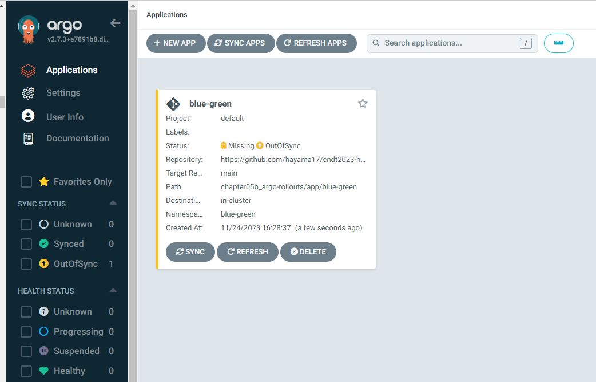
  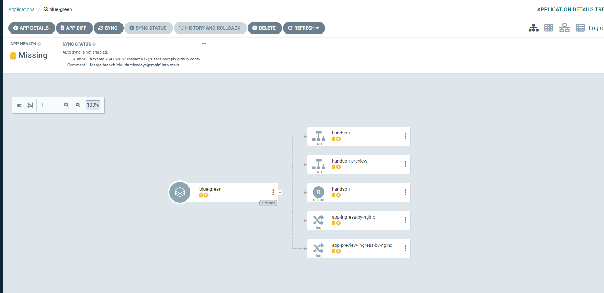
  
 ページ上部にある SYNC をクリックして、無事デプロイされると下記のようになります
  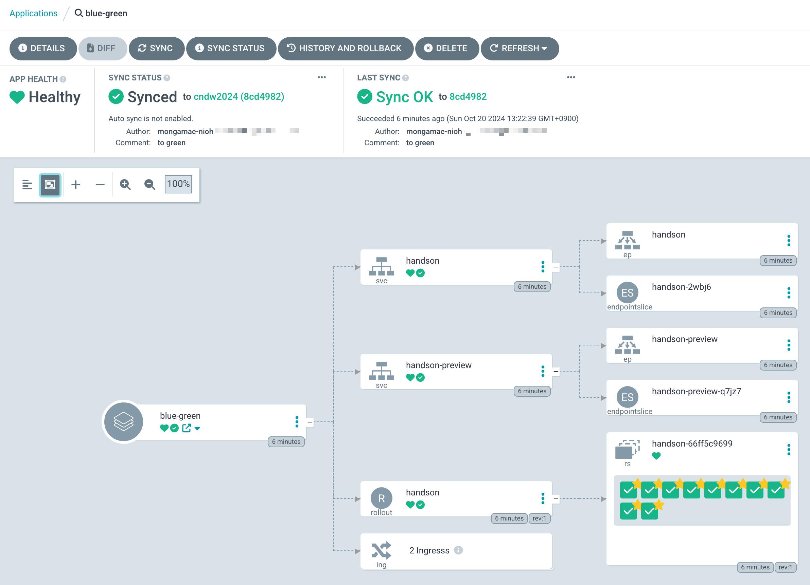

以上の手順で、Blue/GreenのBlueに当たる状態がArgoCDを用いてデプロイされ、localからingressでアクセス可能となりました。

ここからは、実際にBlue/Green Deploymentyを行いその様子を見ていこうと思います。

 `app/blue-green/rollout.yaml`の編集を行います。 imageのtagをblueからgreenに変更します。
```
image: argoproj/rollouts-demo:green
```
差分をforkしたmainブランチ（appを作成する際に指定したブランチ）に取り込みます。
```
git push origin main
```

 ArgoCDはデフォルトでは3分に一回の頻度でブランチを確認し、差分を検出しています。
 3分待てない場合には、ページ上部にある [REFRESH]をクリックします。下記のようにrolloutにおいて差分が検出されます。（黄色で表示されているOutOfSyncが差分があることを示しています）
 
 ちなみにAppの設定において、SYNC POLICYをManualでなくAutoにしていた場合には、ここでOutOfSyncを検知すると自動でArgoCDがSyncを実行します。

  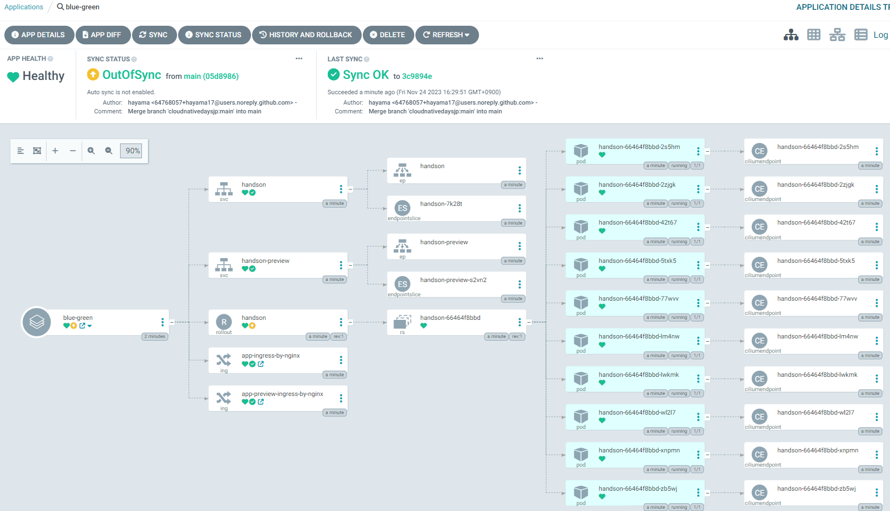
 rolloutを手動でSyncします。 blue, green両方のreplicasetが作成されている事が確認できます。
  

 
 両方のreplicasetが作成されているのは、bluegreen-rollout.yamlにおいてspec.strategy.bluegreen.autoPromotionEnabledがfalseに設定されているからです

 それぞれのingressにアクセスすると下記のようにblueとgreenの異なるタイルが表示されていることが確認できます。
 * app.argocd.vm07.handson.cloudnativedays.jp
 * app-preview.argocd.vm07.handson.cloudnativedays.jp

  
 rolloutの3点リーダーをクリックし [Promote-Full]をクリックすることで、blue-green deployが行われます。プロモートが行われたどちらのingressもgreenを見るようになり、blueのreplicasetは削除されます。
  
 
 このように、ArgoRolloutのBlue/Green Deploymentにおいては、一旦greenに当たるサービスが、previewServiceとして登録され、プロモートすることで、activeServiceに昇格するような動きをして、Blue/Green Deploymentを実現します。  
 
 
rollout-extensionを使用した場合、rolloutを選択しmoreのタブが出現します。moreのタブを選ぶとこのようにblueとgreenがどうなっているか一目で確認できるようになります。
  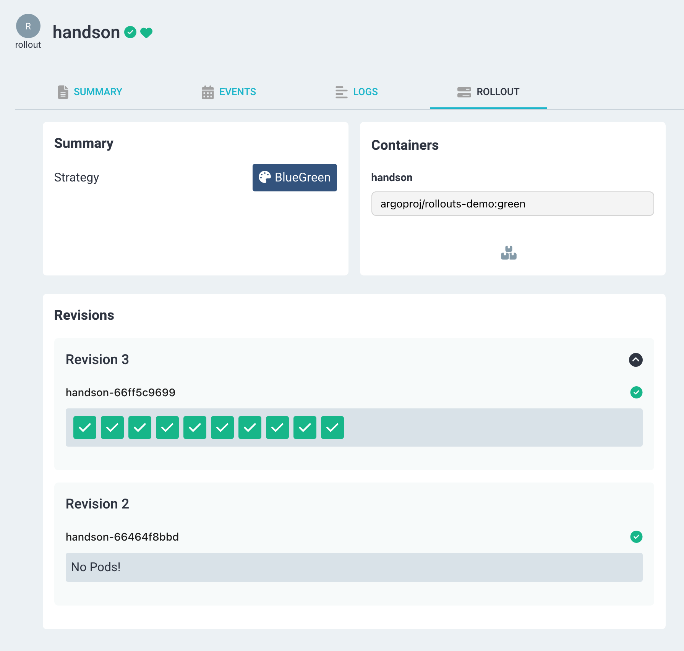
最後にアプリケーションの削除を行います。 Deleteをクリックします


Applications画面の場合は、一番右下の端に、


詳細画面の場合は、右上の2番目にあります。


削除する際にアプリケーション名の入力があるので「blue-green」と入力してOKをクリックします。
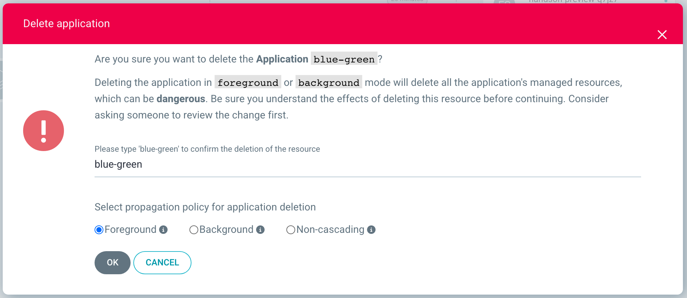

### Canary Release
 Applicationsの画面において + NEW APPをクリックします
 上の画面上で各項目を次のように設定します。
  ```
  GENERAL
    Application Name: canary
    Project Name: default
    SYNC POLICY: Manual
    SYNC OPTIONS: AUTO CREATE NAMESPACE [v]
    SOURCE
      Repository URL: https://github.com/自身のアカウント名/cndt2023-handson
      Revision: main
      Path: chapter_argo-rollouts/app/canary
    DESTINATION
      Cluster URL: https://kubernetes.default.svc
      Namespace: canary
  ```
 設定できたら、CREATEをクリックして、下記のように表示されていることを確認して下さい
  
  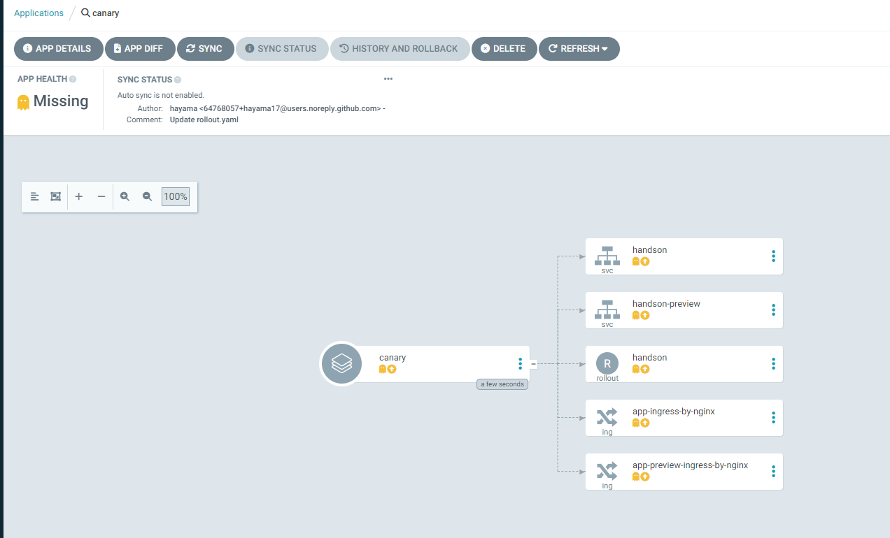
  
 ページ上部にある SYNC をクリックして、無事デプロイされると下記のようになります
  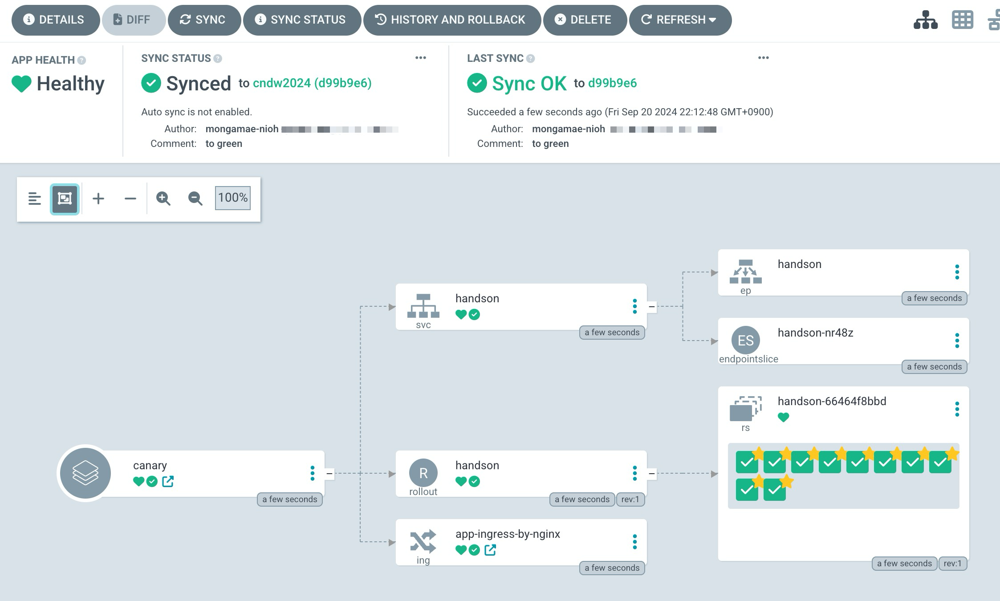

以上の手順で、Canary Releaseにおける安定バージョンがArgoCDを用いてデプロイされ、localからingressでアクセス可能となりました

ここからは、実際に、Canary Releaseを行いその様子を見ていこうと思います。

 `app/canary/rollout.yaml`の編集を行います。imageのtagをblueからgreenに変更します。
```
image: argoproj/rollouts-demo:green
```
差分をforkしたmainブランチ（appを作成する際に指定したブランチ）に取り込みます。
```
git push origin main
```

 ArgoCDはデフォルトでは3分に一回の頻度でブランチを確認し、差分を検出しています。3分待てない場合には、ページ上部にある [REFRESH]をクリックします。下記のようにrolloutにおいて差分が検出されます。（黄色で表示されているOutOfSyncが差分があることを示しています）
ちなみにAppの設定において、SYNC POLICYをManualでなくAutoにしていた場合には、ここでOutOfSyncを検知すると自動でArgoCDがSyncを実行します。
  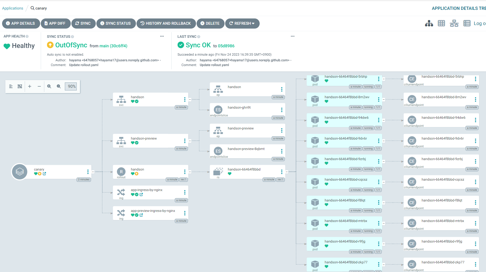
rolloutを手動でSyncします
  
syncされた結果安定バージョンと新バージョンの両方のreplicasetが確認できます。
  
ingressにアクセスすると下記のように、安定バージョンであるBlueから新バージョンであるGreenのタイルが少しづつ増えて行っているのが確認できます。
  
rollout-extensionを使用した場合、rolloutを選択しmoreのタブが出現します。moreのタブを選ぶと、アプリケーションの動作を確認せずともどこのStepを動いているのが一目で確認できるようになります。
  
全てのpodを新バージョンにアップデートしたい場合には、rolloutのPromote Fullをクリックして下さい。

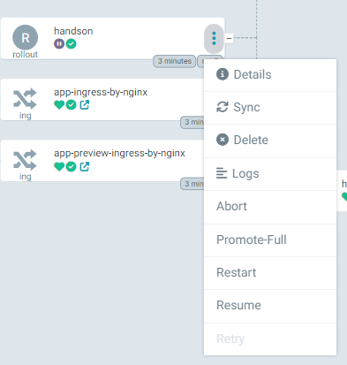

デモアプリへアクセスしてアップデートが完了していることを確認して下さい。

最後にアプリケーションの削除を行います。 Deleteをクリックします。

Applications画面の場合は、一番右下の端に、


詳細画面の場合は、右上の2番目にあります。


削除する際にアプリケーション名の入力があるので「canary」と入力してOKをクリックします。


## Analysis Metrics
新しいリリースやバージョンを本番環境に展開する前に、新バージョンの健康状態やパフォーマンスなどを評価するために使用されます。
例えば、Blue/Green Deployの場合、Green（新バージョン）への切り替えの前にGreenのデプロイが成功しているのか一度確認したり、Canary Releaseの場合、新バージョンのパフォーマンスの分析等に利用されます。
### Metricsの種類
* Job
* Web
* Prometheus
* Datadog
* NewRelic
* Wavefront
* Kayenta
* CloudWatch
* Graphite
* InfluxDB
* Apache SkyWalking
* 独自Plugin


### Job metrics (Blue/Green Deploy)
アップデートする際に、jobをデプロイし、jobの実行結果によってBlue/Green DeployをPromoteするかどうかを判断させるAnalysisを作成します。
  
  
Applicationsの画面において + NEW APPをクリックします

上の画面上で各項目を次のように設定します。
  ```
  GENERAL
    Application Name: job
    Project Name: default
    SYNC POLICY: Manual
    SYNC OPTIONS: AUTO CREATE NAMESPACE [v]
    SOURCE
      Repository URL: https://github.com/自身のアカウント名/cndt2023-handson
      Revision: main
      Path: chapter_argo-rollouts/analysis/job
    DESTINATION
      Cluster URL: https://kubernetes.default.svc
      Namespace: job-analysis
  ```
設定できたら、CREATEをクリックして、下記のように表示されていることを確認して下さい

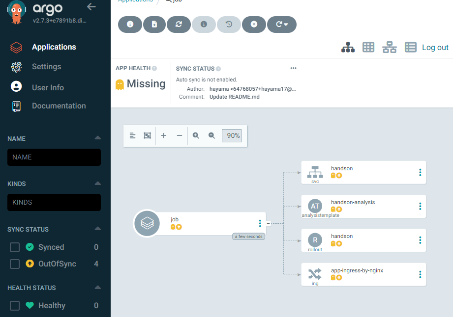

ページ上部にある SYNC をクリックします


analysis/job/rollout.yamlの編集を行います。 imageのtagをblueからgreenに変更します。

```yaml
image: argoproj/rollouts-demo:green
```
差分をforkしたmainブランチ（appを作成する際に指定したブランチ）に取り込みます。
```
git push origin main
```
ArgoCDはデフォルトでは3分に一回の頻度でブランチを確認し、差分を検出しています。3分待てない場合には、ページ上部にある [REFRESH]をクリックします。下記のようにrolloutにおいて差分が検出されます。（黄色で表示されているOutOfSyncが差分があることを示しています）
ちなみにAppの設定において、SYNC POLICYをManualでなくAutoにしていた場合には、ここでOutOfSyncを検知すると自動でArgoCDがSyncを実行します。

rolloutを手動でSyncすると、アプリケーションのpodと新たにAnalysisrunが生成され、jobが発行されたのが確認できます。

jobが成功すると、自動的にBlue/Green Deployが進んでいくのが分かります。

最後にアプリケーションの削除を行います。 Deleteをクリックします


Applications画面の場合は、一番右下の端に、


詳細画面の場合は、右上の2番目にあります。


削除する際にアプリケーション名の入力があるので「job」と入力してOKをクリックします。


### Web metrics (Blue/Green Deploy)
Analysis実行時にリクエストを送信し、レスポンスの内容にてよってPromoteするかどうかを判断します
  * Json形式のレスポンスの場合Jsonの中身を見て判断します
  * Json形式以外のレスポンスの場合はstatus codeが200であるかどうかの判断になります

Applicationsの画面において + NEW APPをクリックします

上の画面上で各項目を次のように設定します。
  ```
  GENERAL
    Application Name: web
    Project Name: default
    SYNC POLICY: Manual
    SYNC OPTIONS: AUTO CREATE NAMESPACE [v]
    SOURCE
      Repository URL: https://github.com/自身のアカウント名/cndt2023-handson
      Revision: main
      Path: chapter_argo-rollouts/analysis/web
    DESTINATION
      Cluster URL: https://kubernetes.default.svc
      Namespace: web-analysis
  ```
設定できたら、CREATEをクリックして、下記のように表示されていることを確認して下さい
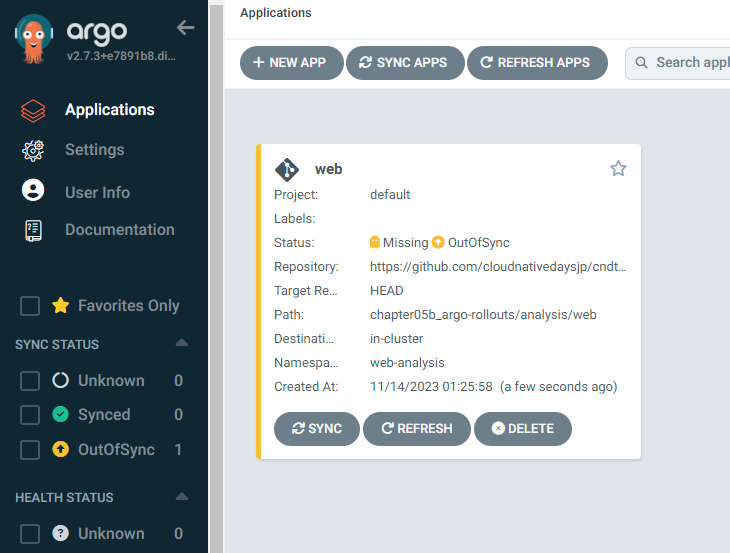
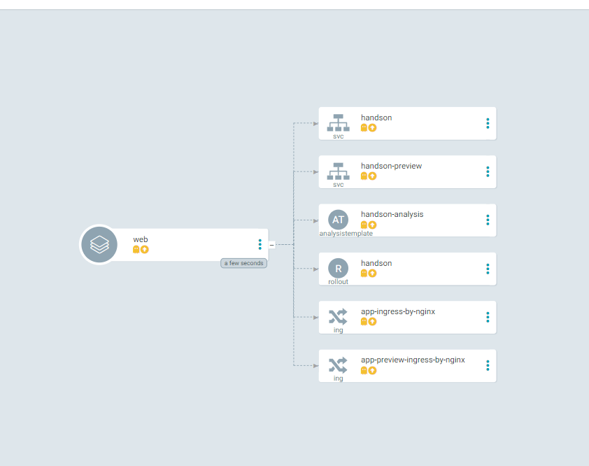

ページ上部にある SYNC をクリックします
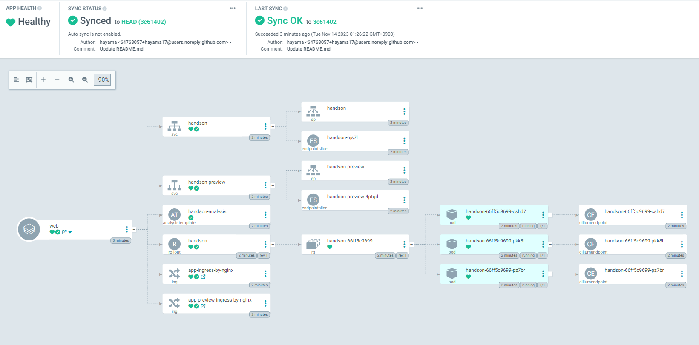


analysis/web/rollout.yamlの編集を行います。 imageのtagをblueからgreenに変更します。

```yaml
image: argoproj/rollouts-demo:green
```
差分をforkしたmainブランチ（appを作成する際に指定したブランチ）に取り込みます。
```
git push origin main
```
ArgoCDはデフォルトでは3分に一回の頻度でブランチを確認し、差分を検出しています。3分待てない場合には、ページ上部にある [REFRESH]をクリックします。下記のようにrolloutにおいて差分が検出されます。（黄色で表示されているOutOfSyncが差分があることを示しています）
ちなみにAppの設定において、SYNC POLICYをManualでなくAutoにしていた場合には、ここでOutOfSyncを検知すると自動でArgoCDがSyncを実行します。

rolloutを手動でSyncすると、アプリケーションのpodと新たにAnalysisrunが生成されます。

Analysisrunの詳細をクリックし、Live Manifestを確認するとどういったレスポンスが帰ってきて、成功したのか失敗したのか確認できます。
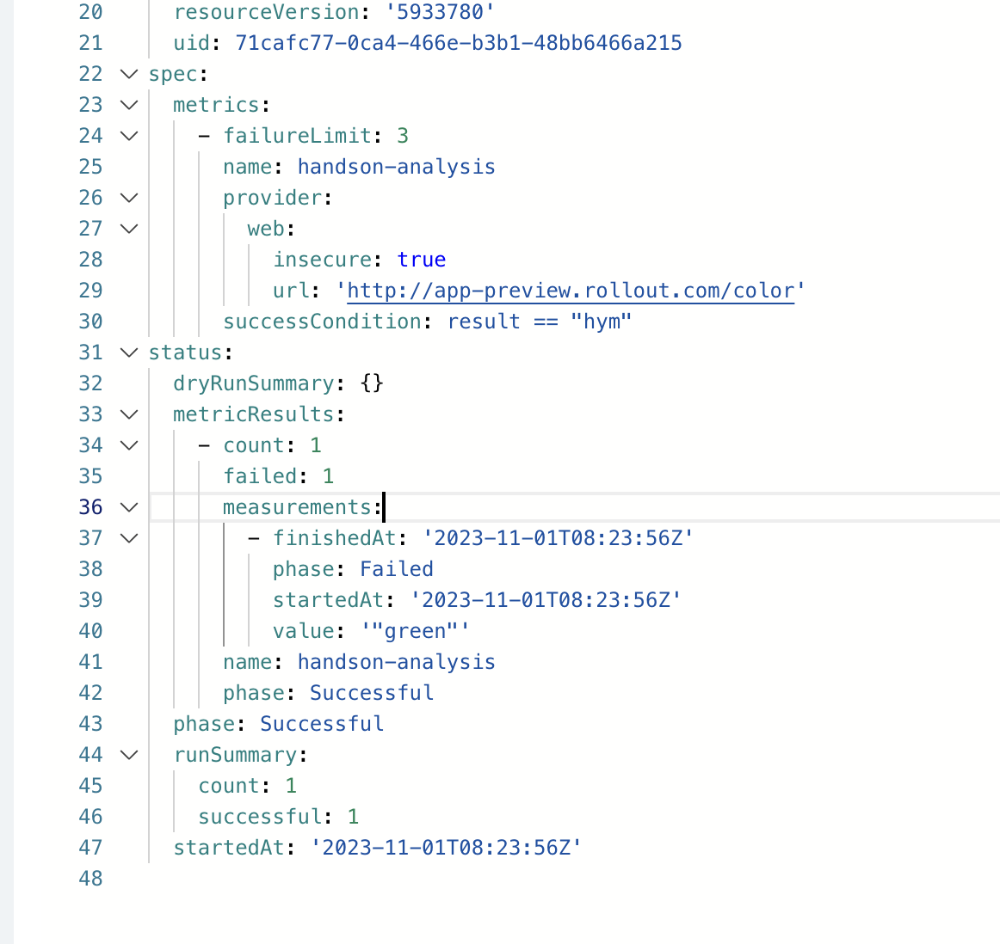
正常なレスポンスが到達すると、自動的にBlue/Green Deployが進んでいくのが分かります。

最後にアプリケーションの削除を行います。 Deleteをクリックします。

Applications画面の場合は、一番右下の端に、


詳細画面の場合は、右上の2番目にあります。


削除する際にアプリケーション名の入力があるので「web」と入力してOKをクリックします。

### Prometheus metrics (Canary Release)
Analysis実行時にPrometheusにPromQLを送信し、その結果によってPromoteするかどうかを判断します

Applicationsの画面において + NEW APPをクリックします

上の画面上で各項目を次のように設定します。
  ```
  GENERAL
    Application Name: prometheus
    Project Name: default
    SYNC POLICY: Manual
    SYNC OPTIONS: AUTO CREATE NAMESPACE [v]
    SOURCE
      Repository URL: https://github.com/自身のアカウント名/cndt2023-handson
      Revision: main
      Path: chapter_argo-rollouts/analysis/prometheus
    DESTINATION
      Cluster URL: https://kubernetes.default.svc
      Namespace: prometheus-analysis
  ```
設定できたら、CREATEをクリックして、下記のように表示されていることを確認して下さい

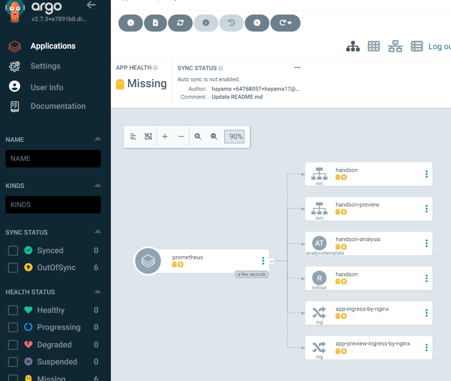

ページ上部にある SYNC をクリックします
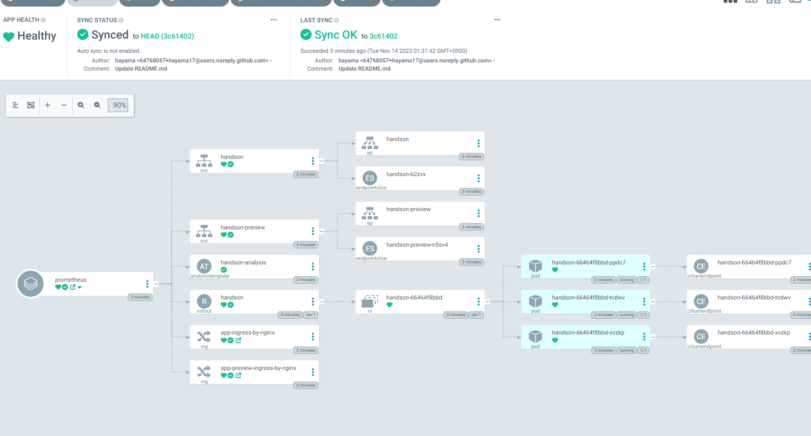


analysis/prometheus/rollout.yamlの編集を行います。 imageのtagをblueからgreenに変更します。

```yaml
image: argoproj/rollouts-demo:green
```
差分をforkしたmainブランチ（appを作成する際に指定したブランチ）に取り込みます。
```
git push origin main
```
ArgoCDはデフォルトでは3分に一回の頻度でブランチを確認し、差分を検出しています。3分待てない場合には、ページ上部にある [REFRESH]をクリックします。下記のようにrolloutにおいて差分が検出されます。（黄色で表示されているOutOfSyncが差分があることを示しています）
ちなみにAppの設定において、SYNC POLICYをManualでなくAutoにしていた場合には、ここでOutOfSyncを検知すると自動でArgoCDがSyncを実行します。

rolloutを手動でSyncすると、アプリケーションのpodと新たにAnalysisrunが生成されます。


Analysisrunの詳細をクリックし、Live Manifestを確認するとどういったレスポンスが帰ってきて、成功したのか失敗したのか確認できます。

Analysisrunが成功すると、自動的にCanary Releseが進んでいくのが分かります。
最後にアプリケーションの削除を行います。 Deleteをクリックします


Applications画面の場合は、一番右下の端に、


詳細画面の場合は、右上の2番目にあります。


削除する際にアプリケーション名の入力があるので「prometheus」と入力してOKをクリックします。


## Argo Rolloutsのクリーンアップ
### Argo CDを削除
```
helmfile destroy -f  ../chapter_argocd/helm/helmfile.yaml
kubectl delete -n argo-cd \
    -f https://raw.githubusercontent.com/argoproj-labs/rollout-extension/v0.2.1/manifests/install.yaml
kubectl delete namespace argo-cd
```
### Argo Rolloutsを削除
```
helmfile destroy -f  ./helm/helmfile.yaml
kubectl delete namespace argo-rollouts blue-green canary job-analysis prometheus-analysis web-analysis
```
