# Istio
本chapterではIstioを用いて、サービスメッシュ内のトラフィック管理、可視化をどのように実現するのか体験します。

## 目次
- [概要](#概要)
- [セットアップ](#セットアップ)
- [ルーティング制御](#ルーティング制御)
- [認可制御](#認可制御)
- [まとめ](#まとめ)
- [最終クリーンアップ](#最終クリーンアップ)

## 概要
### Istioとは
Istioはサービスメッシュを実現するためのオープンソースのソフトウェアです。Google, IBM, Lyftによって2017年に開発が開始されましたが、現在多くのコントリビューターによって開発が進めらているCNCFのgraduatedプロジェクトです。Istioを使用することで、アプリケーションにほとんど、または全く変更を加えることなく、マイクロサービス構成のアプリケーションにサービスメッシュを追加することが可能です。

Istioが提供する主な機能は下記のとおりです。

- TLS暗号化によるサービス間通信のセキュリティ確保、強力なアイデンティティベースの認証と承認
- HTTP、gRPC、WebSocket、およびTCPトラフィックの自動負荷分散
- 細かなルーティングルール、リトライ、フェイルオーバー、およびフォールトインジェクションによるトラフィック管理
- アクセス制御、レート制限、クォータのサポートを提供するプラガブルなポリシーレイヤーとAPI
- Istioサービスメッシュへの/からの出入口を含むすべてのトラフィックの自動メトリクス、ログ、トレース

### サービスメッシュとは
サービスメッシュとは、サービス間通信を処理するための専用インフラストラクチャレイヤーです。これにより、透過的に観測性、トラフィック管理、セキュリティなどの機能をアプリケーションに組み込むことなく利用することが可能です。特にcloud nativeアプリケーションにおいてはKubernetesのようなオーケストレーターによって動的にワークロードがスケジューリングされるため、サービス間通信が複雑になります。この管理をアプリケーションではなくサービスメッシュが行うことにより、アプリケーションの管理、運用を容易にできます。

### Istioアーキテクチャ


(出展元: https://istio.io/latest/docs/ops/deployment/architecture/)

Istioサービスメッシュは大きく2つのコンポーネントで構成されます。
- コントロールプレーン: Istiodというシングルバイナリで、トラフィックをproxyするための設定、および管理をします。このシングルバイナリはPilot, Citadel, Galleyと呼ばれるコンポーネントで構成されており、各コンポーネントの主な機能は下記のとおりです。

  - Pilot: ランタイム時のproxy設定
  - Citadel: メッシュ内で使用される証明書の発行、更新
  - Galley: メッシュ内設定の検証、取り込み、集約、変換、配布

- データプレーン: サイドカーとしてdeployされるenvoyベースのプロキシです。マイクロサービス間のすべてのネットワーク通信を制御し、メッシュトラフィック全体に関するテレメトリの収集を行います。

## 始める前に
- Handson用のアプリケーションがdeployされていること(まだの場合は[こちら](../chapter_cluster-create/README.md#アプリケーションのデプロイ))
- Prometheusがインストールされていること(まだの場合は[こちら](../chapter_prometheus/README.md#実践-kube-prometheus-stackのインストール))

## セットアップ
### インストール
Istioコンポーネントと併せて、Kialiをインストールします。

> [!NOTE]
>
> KialiはIstioサービスメッシュ用のコンソールであり、Kialiが提供するダッシュボードから、サービスメッシュの構造の確認、トラフィックフローの監視、および、サービスメッシュ設定の確認、変更をすることが可能です。本chapterでは説明は省略していますので、詳細は[こちら](https://kiali.io)をご確認ください。

```sh
helmfile sync -f helm/helmfile.yaml
```

作成されるリソースは下記のとおりです。
```sh
kubectl get services,deployments -n istio-system
```
```sh
# 実行結果
NAME                           TYPE        CLUSTER-IP      EXTERNAL-IP   PORT(S)                                 AGE
service/istio-ingressgateway   NodePort    10.96.73.231    <none>        18080:32080/TCP,18443:32443/TCP         55m
service/istiod                 ClusterIP   10.96.238.211   <none>        15010/TCP,15012/TCP,443/TCP,15014/TCP   55m
service/kiali                  ClusterIP   10.96.160.114   <none>        20001/TCP                               55m

NAME                                   READY   UP-TO-DATE   AVAILABLE   AGE
deployment.apps/istio-ingressgateway   1/1     1            1           55m
deployment.apps/istiod                 1/1     1            1           55m
deployment.apps/kiali                  1/1     1            1           55m
```
`istiod`がコントロールプレーンです。データプレーンはアプリケーションpodにサイドカーとして注入されるため、この段階ではまだリソースとして確認をすることはできません。

それでは、Envoy sidecar proxyをアプリケーションpodに自動注入するようIstioに指示するために、デプロイ先のKubernetes namespaceにラベルを追加します。
```sh
kubectl label namespace handson istio-injection=enabled
```
ラベルが追加されたことを確認してください。
```sh
kubectl get namespace handson --show-labels
```
```sh
# 実行結果
NAME      STATUS   AGE    LABELS
handson   Active   175m   istio-injection=enabled,kubernetes.io/metadata.name=handson
```

Handson用のワークロードを再起動し、podにサイドカーとしてenvoy proxyが注入されるようにします。
```sh
kubectl rollout restart deployment/handson-blue -n handson
```

再起動のリソースは下記の通りです。Podが`Running`状態になった後、コンテナが2つ動作していることを確認してください。

```sh
kubectl get services,pods -n handson -l app=handson
```

> [!NOTE]
>
> chapter_opentelemetryで[traceをopentelemetryで管理する例](../chapter_opentelemetry/README.md#trace-をopentelemetryで管理する例)を実装している場合はコンテナ数は3になります。

```sh
＃ 実行結果
NAME              TYPE        CLUSTER-IP      EXTERNAL-IP   PORT(S)   AGE
service/handson   ClusterIP   10.96.191.153   <none>        80/TCP    3m36s

NAME                                READY   STATUS    RESTARTS   AGE
pod/handson-blue-6c4f4c9c57-597dx   2/2     Running   0          26s
```

Envoy proxyがサイドカーとしてアプリケーションpodに注入されているか確認しましょう。
```sh
kubectl get pods -n handson -l app=handson -o jsonpath={.items..spec..containers..image} | tr -s '[[:space:]]' '\n';echo
```
```sh
# 実行結果
docker.io/istio/proxyv2:1.19.0
argoproj/rollouts-demo:blue

# Tracingをopentelemetry管理している場合は下記も併せて表示されます。
ghcr.io/open-telemetry/opentelemetry-go-instrumentation/autoinstrumentation-go:v0.7.0-alpha
```
`docker.io/istio/proxyv2`のイメージで動作しているコンテナがデータプレーンです。

### メッシュ外からのアクセス
Istioメッシュ外からのアクセスをIstioメッシュ内のアプリケーションにルーティングできるようするためにIstio gateway/virtual serviceを作成します。

```sh
kubectl apply -f networking/gateway.yaml
kubectl apply -f networking/simple-routing.yaml
```

作成されるリソースは下記のとおりです。

> [!NOTE]
>
> Kubernetes Gateway APIの`gateway`リソースがデプロイされている場合、`kubectl get gateways`はKubernetes Gateway APIのgatewayリソースが優先されてIstioが管理するgatewayリソースが表示されなくなるため、Istio gatewayリソースaliasの`gw`を使用しています。

```sh
kubectl get gw,virtualservices -n handson
```
```sh
# 実行結果
NAME                                  AGE
gateway.networking.istio.io/handson   18s

NAME                                                GATEWAYS      HOSTS                                     AGE
virtualservice.networking.istio.io/simple-routing   ["handson"]   ["app.vm17.handson.cloudnativedays.jp"]   25s
```

これでメッシュ外からのアクセスをアプリケーションにルーティングする準備ができました。ブラウザから<http://app.vm17.handson.cloudnativedays.jp:18080>にアクセスしてアプリケーションが表示されることを確認してください。


### メッシュの可視化
Kialiを用いてIstioサービスメッシュ内のトラフィックを見てみましょう。Kialiは[インストール](#インストール)でインストール済みなので、外部(インターネット)からアクセスできるようにするためにIngressリソースを作成します。

```sh
kubectl apply -f ingress/kiali-ingress.yaml
```

しばらくすると、ingressリソースにIPが付与されます。
```sh
kubectl get ingresses -n istio-system -l app=kiali
```
```sh
# 実行結果
NAME             CLASS   HOSTS                                   ADDRESS        PORTS   AGE
kiali-by-nginx   nginx   kiali.vm17.handson.cloudnativedays.jp   10.96.88.164   80      2m5s
```

ブラウザから<http://kiali.vm17.handson.cloudnativedays.jp>にアクセスをしてKialiダッシュボードが表示されることを確認してください。

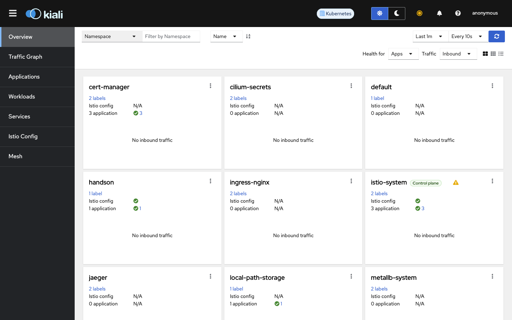

Kialiダッシュボードのグラフ表示の設定を変更します。TOP画面左のサイドメニューの`Graph`をクリックし、画面上部にある表示項目を下記の通り設定してください。
- `Namespace`の`handson`にチェック

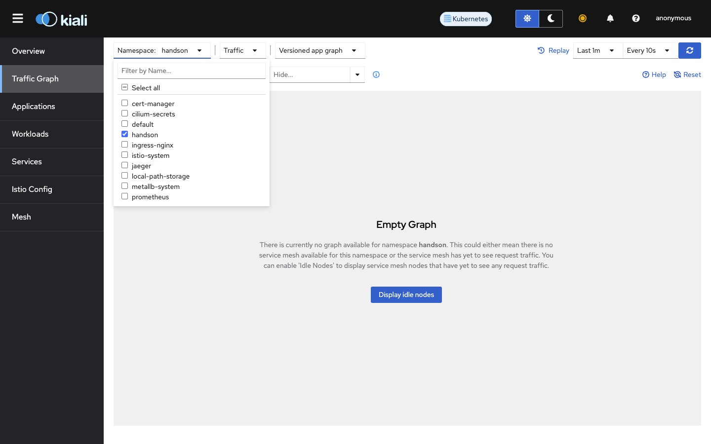

- `Versioned app graph`から`Workload graph`に変更

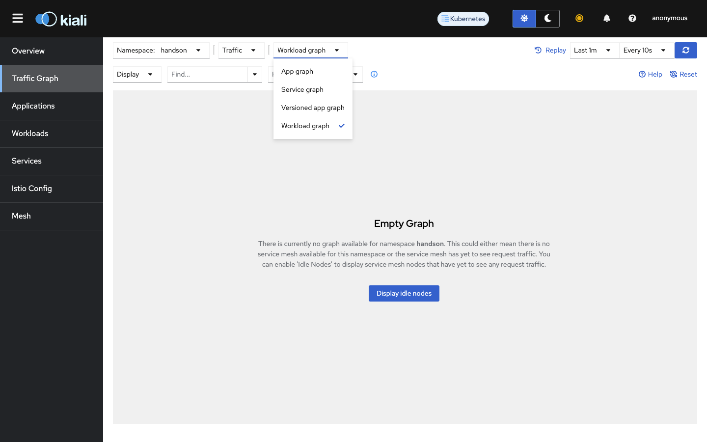

- `Display`項目から`Traffic Distribution`をチェック

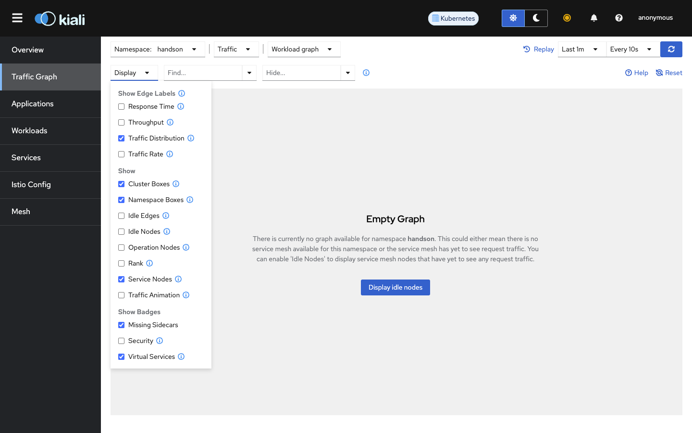

- グラフ更新期間を`Every 1m`から`Every 10s`に変更


## ルーティング制御

IstioのVirtual Serviceを利用する事でL7レベルでトラフィックを制御する事ができます。
本章ではBlue/Green Deployment, Canary Deploymentでも利用される加重ルーティング、そして特定のリクエストだけを異なるアプリケーションにルーティングさせるL7レベルでのトラフィック制御についてご紹介いたします。

### 加重ルーティング
Istio Virtual Service/Destination Ruleを用いて加重ルーティングを実装します。旧バージョンから新バージョンへのアプリケーションの段階的な移行がユースケースとして挙げられます。本ケースでは、現在稼働しているアプリケーションとコンテナイメージタグが異なる追加のアプリケーションをdeployし、トラフィックを50%ずつ振り分けて、最終的に新しいアプリケーションに移行するシナリオを想定します。

[セットアップ](#セットアップ)が完了していることを前提とします。

#### 追加アプリケーションのdeploy
現在動作中のアプリケーションは下記のとおりです。
```sh
kubectl get pods -n handson -l app=handson
```
```sh
# 実行結果
NAME                            READY   STATUS    RESTARTS   AGE
handson-blue-6c4f4c9c57-597dx   2/2     Running   0          5m
```

加重ルーティング実装のための追加アプリケーションをデプロイします。
```sh
kubectl apply -f ../chapter_cluster-create/manifest/app/serviceaccount.yaml -n handson -l color=yellow
kubectl apply -f ../chapter_cluster-create/manifest/app/deployment.yaml -n handson -l color=yellow
```

2つのワークロードが`handson` namespaceで稼働していることを確認してください。
```sh
kubectl get pods -n handson -l app=handson
```
```sh
# 実行結果
NAME                              READY   STATUS    RESTARTS   AGE
handson-blue-6c4f4c9c57-597dx     2/2     Running   0          64m
handson-yellow-5f468df4f7-w669z   2/2     Running   0          62s
```

#### トラフィック移行
50%ずつ加重ルーティングされるように[メッシュ外からのアクセス](#メッシュ外からのアクセス)で作成したIstio Virtual Serviceを削除し、新しいメッシュ内ルーティング設定をします。
```sh
kubectl delete -f networking/simple-routing.yaml
kubectl apply -f networking/weight-based-routing.yaml
```

作成されるリソースは下記のとおりです。
```sh
kubectl get virtualservices,destinationrules -n handson
```
```sh
# 実行結果
NAME                                                      GATEWAYS      HOSTS                                     AGE
virtualservice.networking.istio.io/weight-based-routing   ["handson"]   ["app.vm17.handson.cloudnativedays.jp"]   35s

NAME                                                       HOST      AGE
destinationrule.networking.istio.io/weight-based-routing   handson   35s
```

実際にリクエストを流して、期待した通り50%ずつトラフィックが流れているかKialiで確認してみましょう。**ローカル端末から**下記コマンドを実行してください。
```sh
while :; do curl -s -o /dev/null -w '%{http_code}\n' http://app.vm17.handson.cloudnativedays.jp:18080;sleep 1;done
```

しばらくすると、グラフが表示されます(なかなか表示されない場合は、Kialiダッシュボード右上の青い`Refresh`ボタンを押して状態を更新してください)。しばらくすると、トラフィックが均等(約±5%)にルーティングされていることを確認してください。
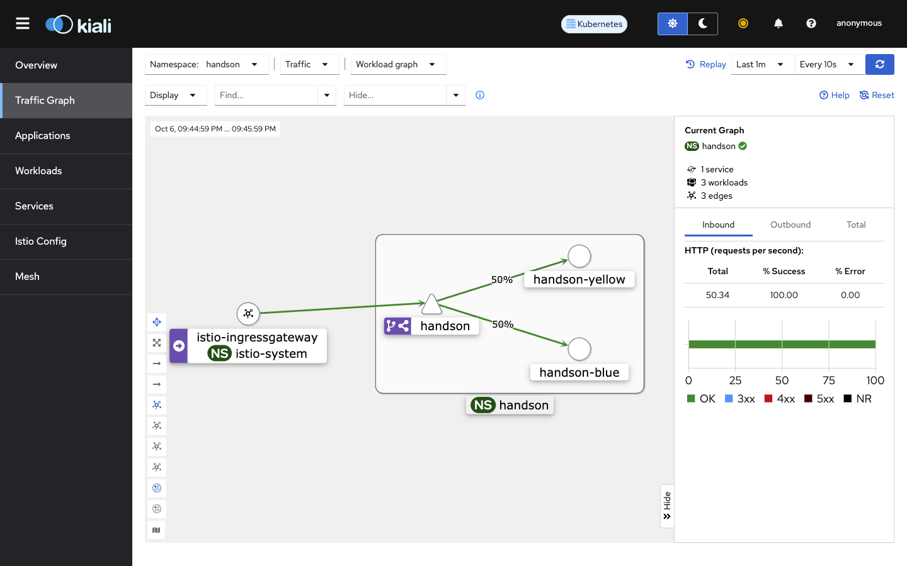

それでは、新しいアプリケーションにトラフィックが100%ルーティングされるように設定を変更します。ローカル環境から実施しているリクエストは継続して行なってください。
```sh
kubectl patch virtualservice weight-based-routing -n handson --type merge --patch-file networking/weight-based-routing-patch.yaml
```

しばらくすると、新しいアプリケーションにトラッフィックが100%ルーティングされていることが確認できます(変化が見られない場合は、Kialiダッシュボード右上の青い`Refresh`ボタンを押して状態を更新してください)。
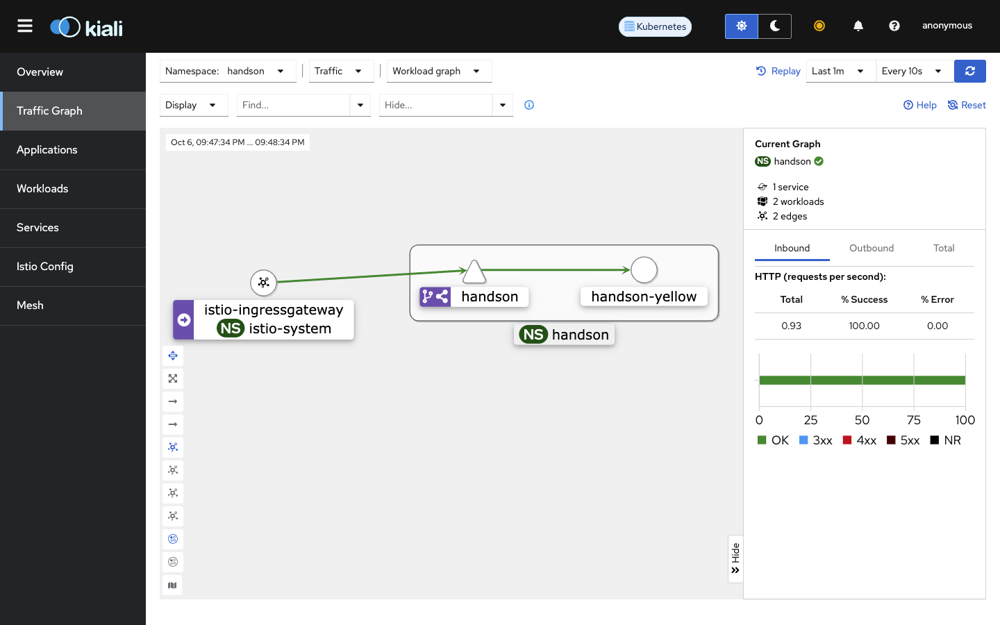

確認ができたらリクエストを停止してください。

Istio Virtual Service/Destination Ruleを使用して、加重ルーティングを実装しました。Istioの機能を利用することで、アプリケーション側にロジックを追加することなく複数アプリケーション間のトラフィック移行を実現できます。

### HTTPリクエストベースでのルーティング

Istio Virtual Service/Destination Ruleを用いてHTTPリクエストの内容に基づいてルーティングを変更してみましょう。
メンテナンス時間において一時的なルーティングの変更、また一時的にテストユーザーへの新機能公開において、特定の利用者のみ新しいバージョンのアプリケーションを利用するシナリオを想定しています。

アプリケーションは上記[加重ルーティング](#加重ルーティング)で配備したアプリケーションを利用します。
まずは加重ルーティングの設定を削除し、HTTPリクエストによるルーティングを設定します。

```sh
kubectl delete -f networking/weight-based-routing.yaml
kubectl apply -f networking/http-request-based-routing.yaml
```

作成されるリソースは下記のとおりです。
```sh
kubectl get virtualservices,destinationrules -n handson
```
```sh
# 実行結果
NAME                                                            GATEWAYS      HOSTS                                     AGE
virtualservice.networking.istio.io/http-request-based-routing   ["handson"]   ["app.vm17.handson.cloudnativedays.jp"]   31s

NAME                                                             HOST      AGE
destinationrule.networking.istio.io/http-request-based-routing   handson   31s
```

`"handson: alpha1" `ヘッダー持つ、リクエストを流してみましょう。**ローカル端末から**下記コマンドを実行してください。

```sh
while :; do curl -s -w '\t%{http_code}\n' http://app.vm17.handson.cloudnativedays.jp:18080/color -H 'handson: alpha1';sleep 1;done
```

コンソールには下記のように表示されるはずです。

```sh
"yellow"        200
"yellow"        200
"yellow"        200
"yellow"        200
```

Kialiでトラフィックを確認すると、`handson-yellow` トラフィックが流れている事がわかります(なかなか表示されない場合は、Kialiダッシュボード右上の青い`Refresh`ボタンを押して状態を更新してください)。


それでは、いったんリクエストを停止し、次のリクエストを流してみましょう。先ほどとの違いはヘッダーの値が `beta1` となっていることです。

```sh
while :; do curl -s -w '\t%{http_code}\n' http://app.vm17.handson.cloudnativedays.jp:18080/color -H 'handson: beta1';sleep 1;done
```

コンソールには下記のように表示されるはずです。

```sh
"blue"  200
"blue"  200
"blue"  200
```

Kialiでトラフィックを確認すると、`handson-blue` トラフィックが流れている事がわかります(なかなか表示されない場合は、Kialiダッシュボード右上の青い`Refresh`ボタンを押して状態を更新してください)。

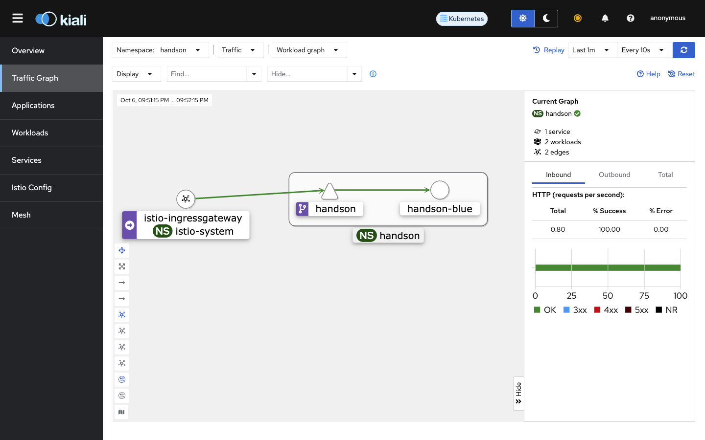

最後に、ヘッダーを何もつけない場合どのようになるのか確認してみましょう。

```sh
while :; do curl -s -w '%{http_code}\n' http://app.vm17.handson.cloudnativedays.jp:18080/color ;sleep 1;done
```

コンソールには下記のように表示されるはずです。

```sh
302
302
302
```

Kialiでトラフィックを確認すると、workload側にはトラフィックが流れていないことがわかります。<br>
[HTTPRedirect](https://istio.io/latest/docs/reference/config/networking/virtual-service/#HTTPRedirect)を使う際は、デフォルトのHTTPレスポンスコードが301(MOVED_PERMANENTLY)であることに注意してください。利用シーンとして一時的にトラフィックを別の場所にリダイレクトさせたい場合は、302(Found)などを使うようにしましょう。301を使う場合は、ブラウザ側がそのリダイレクト情報をキャッシュしてしまいます。


確認ができたらリクエストを停止してください。

Istio Virtual Service/Destination Ruleを使用して、特定のバージョンのアプリケーションに特定のユーザーからのアクセスを流すこと、一時的にリダイレクトなどを行うことを実現できます。<br>
また、[HTTPDirectResponse](https://istio.io/latest/docs/reference/config/networking/virtual-service/#HTTPDirectResponse)を使うことで、Workloadにトラフィックを流す、直接特定のHTTPレスポンス情報を返すことも可能です。


### Fault Injection

Fault Injectionを利用することで、特定のリクエストに対して指定した割合で意図的な遅延を発生させること、そして特定のHTTPステータスを返すことができます。テスト時において、通常では検証が難しいような異常系のテストを実環境でテストする事が可能となります。

Fault Injectionは、HTTPS(TLS)通信を対象には機能しないことに注意してください。暗号化されていない通信のみを対象として挿入する事ができます。

それではいったnルーティング設定を一番シンプルな[simple-routing.yaml](./networking/simple-routing.yaml)に戻します。また、追加アプリケーションとしてデプロイした `handson-yellow` を削除しておきます。

```sh
kubectl delete -f networking/http-request-based-routing.yaml
kubectl apply -f networking/simple-routing.yaml
kubectl delete -f ../chapter_cluster-create/manifest/app/deployment.yaml -n handson -l color=yellow
kubectl delete -f ../chapter_cluster-create/manifest/app/serviceaccount.yaml -n handson -l color=yellow
```

実際にリクエストを流して、期待した通り50%ずつトラフィックが流れているかKialiで確認してみましょう。**ローカル端末から**下記コマンドを実行してください。

```sh
while :; do curl -s -o /dev/null -w '%{http_code}\t%{time_total}\n' http://app.vm17.handson.cloudnativedays.jp:18080;sleep 1;done
```

概ね0.1秒以内にレスポンスが返されていることがわかります。

```sh
200     0.027623
200     0.018801
200     0.013586
200     0.015951
200     0.018922
200     0.011657
```

#### 遅延の挿入

それでは50％の割合で、5秒の遅延を入れてみましょう。

```sh
kubectl apply -f networking/simple-routing-inject-delay.yaml
```

しばらくすると、curlコマンドを流しているコンソールでは、下記のように5秒以上かかっているリクエストがあることを確認できるかと思います。

```sh
200     5.021934
200     0.018250
200     5.025690
200     0.025116
200     0.014532
200     5.028753
200     0.081142
200     5.278245
200     5.031547
```

KialiでトラフィックのResponse Timeを確認してみましょう。 Service `handson` と、Deployment `handson-blue` の間の線をクリックしてください。<br>
そうすると右側のパネルに`HTTP Request Response Time (ms)`が下記画面の様に表示されます。そしてマウスのフォーカスを合わせてP99(99%tile)をみてみると、1秒以内である事がわかりますv (見づらい場合は表示期間を伸ばしてみてください)。
この遅延は、アプリケーション到達前のEnvoyの部分で遅延させているものなので、呼び出される側には影響がない事がわかります。

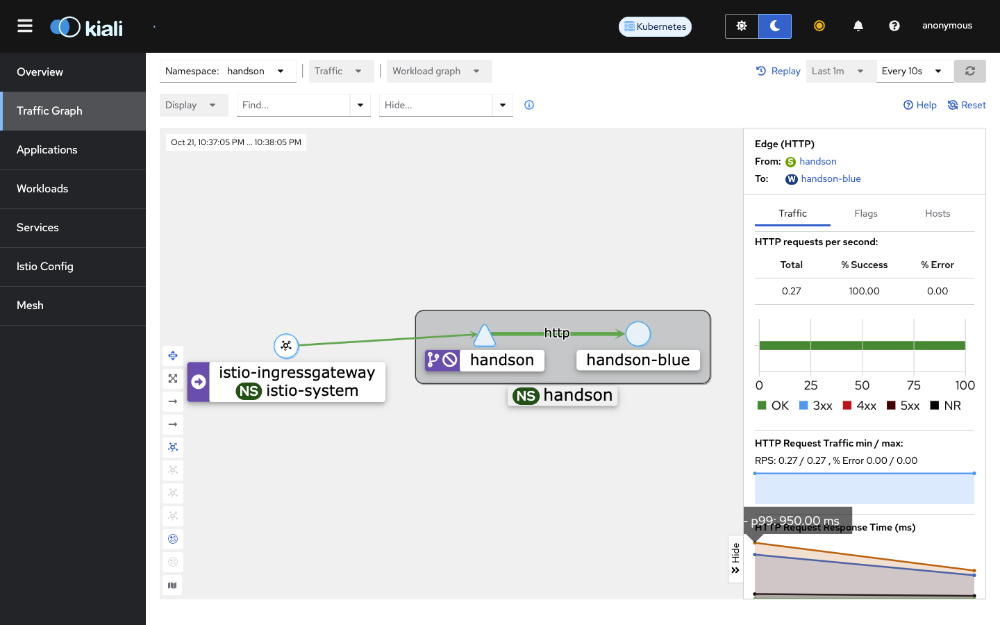

確認する事ができましたら、いったんリクエストを停止してください。


#### HTTPレスポンスエラーの挿入

それでは80％の割合で、レスポンスコード502を返すようにしてみましょう。

```sh
kubectl apply -f networking/simple-routing-inject-error.yaml
```

実際にリクエストを流して、期待した通り50%ずつトラフィックが流れているかKialiで確認してみましょう。**ローカル端末から**下記コマンドを実行してください。

```sh
while :; do curl -s -o /dev/null -w '%{http_code}\t%{time_total}\n' http://app.vm17.handson.cloudnativedays.jp:18080;sleep 1;done
```

curlコマンドを流しているコンソールでは、下記のように表示され、502が多く返されていることがわかるかと思います。

```sh
502     0.196014
502     0.016418
200     0.034566
502     0.012434
200     0.027895
```

確認する事ができましたら、いったんリクエストを停止してください。

### メッシュ外へのアクセス

Istioのサービスメッシュでは、Envoy(ztunnel)が通信を仲介し、相互の通信の可視化や制御を実現しています。
SaaSとして提供されているデータベースへのアクセスや外部APIなどの通信の場合、プロキシ構成によって挙動が変わります。<br>
参考：https://istio.io/latest/docs/tasks/traffic-management/egress/egress-control/

それでは実際にどのような設定になっているのかを見てみましょう。

```sh
kubectl get cm -n istio-system istio -o yaml
```

`meshConfig.outboundTrafficPolicy.mode` の値が、 `REGISTRY_ONLY`　になっていることがわかります。
この場合は、Istioがサービスとして認識しているURIへのアクセスのみを許可します。

```yaml
apiVersion: v1
data:
  mesh: |-
    ...
    outboundTrafficPolicy:
      mode: REGISTRY_ONLY
```

`REGISTRY_ONLY` のモードにおいて外部サービスにアクセスをするためには[Service Entry](https://istio.io/latest/docs/reference/config/networking/service-entry/)を利用します。

まずは、外部へのアクセスが行えないことを確認してみましょう。外部にアクセスするためのWorkloadを `curl` をdeployします。

```sh
kubectl apply -f app/curl.yaml
```

作成されるリソースは下記のとおりです。

```sh
kubectl get pods -n handson -l app=curl
```

```sh
NAME   READY   STATUS    RESTARTS   AGE
curl   2/2     Running   0          26s
```

メッシュ内に存在する、`curl` Podから、メッシュ外に存在する https://vm17.handson.cloudnativedays.jp/ にアクセスしてみましょう。

```sh
while :; do kubectl exec curl -n handson -- curl -s -o /dev/null -w '%{http_code}\t%{errormsg}\n' https://vm17.handson.cloudnativedays.jp/ ;sleep 1;done 2>/dev/null
```

下記のように表示されるはずです。HTTPS通信が確立できずエラーとなっています。

```sh
000     OpenSSL SSL_connect: SSL_ERROR_SYSCALL in connection to vm17.handson.cloudnativedays.jp:443 
000     OpenSSL SSL_connect: SSL_ERROR_SYSCALL in connection to vm17.handson.cloudnativedays.jp:443 
000     OpenSSL SSL_connect: SSL_ERROR_SYSCALL in connection to vm17.handson.cloudnativedays.jp:443 
```

それでは、vm17.handson.cloudnativedays.jpのHTTPS通信をService Entryとして定義しましょう。

```sh
kubectl apply -f networking/service-entry-vm17.handson.cloudnativedays.jp.yaml
```

作成されるリソースは下記のとおりです。

```sh
kubectl get serviceentries -n handson -l content=vm17.handson.cloudnativedays.jp
```

```sh
NAME                                                        HOSTS                                 LOCATION        RESOLUTION   AGE
serviceentry.networking.istio.io/external-cloudnativedays   ["vm17.handson.cloudnativedays.jp"]   MESH_EXTERNAL   NONE         24s
```

実際にリクエストを流して、期待したトラフィックが流れているかKialiで確認してみましょう。下記コマンドを実行してください。

```sh
while :; do kubectl exec curl -n handson -- curl -s -o /dev/null -w '%{http_code}\t%{time_total}\t%{errormsg}\n' https://vm17.handson.cloudnativedays.jp/ ;sleep 1;done 2>/dev/null
```

コンソールには下記のように表示されるはずです。

```sh
200     0.418102
200     0.373627
200     0.216627
200     0.632720
```

Kiali dashboardからも確認してみましょう。リクエストを流した状態でブラウザから<http://kiali.vm17.handson.cloudnativedays.jp>にアクセスをしてください。`curl` のワークロードから `vm17.handson.cloudnativedays.jp` Serviceにアクセスできていることが確認できます。グラフが表示されない場合は、Kialiダッシュボード右上の青い`Refresh`ボタンを押して状態を更新してください。

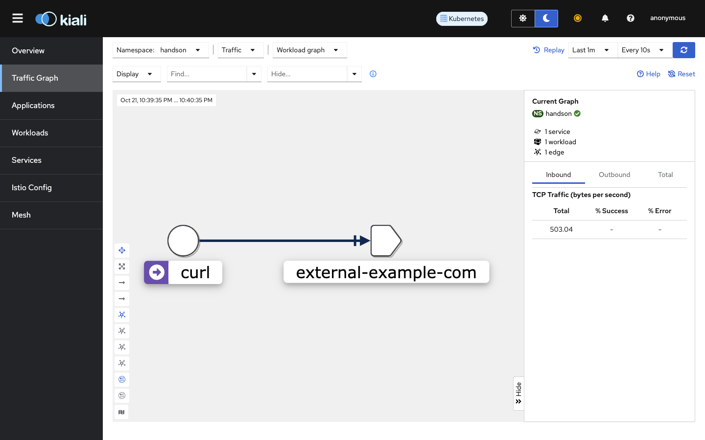

### クリーンアップ

```sh
kubectl delete -f ../chapter_cluster-create/manifest/app/serviceaccount.yaml -n handson -l color=yellow
kubectl delete -f ../chapter_cluster-create/manifest/app/deployment.yaml -n handson -l color=yellow
kubectl delete -f networking/simple-routing.yaml
kubectl delete -f networking/service-entry-cloudnativedays.yaml 
kubectl delete -f networking/gateway.yaml
kubectl delete -f app/curl.yaml
```

## 認可制御

[Istio Authorization Policy](https://istio.io/latest/docs/reference/config/security/authorization-policy/)を利用することによって、各Workloadにおけるアクセスの認可制御を行うことができます。

### L4アクセス管理
L4レベルのトラフィックに対し、Istio Authorization Policyを作成してアクセス管理を実装します。Istioメッシュ内において、あるワークロードに対して特定のワークロードからのL4レベルでのアクセス制御したい時がユースケースとして挙げられます。本ケースでは、`handson-blue`ワークロードが待ち構えているport 8080へアクセスするワークロードを2つ用意し、ひとつからは許可を、もうひとつからは拒否をするケースを想定します。

[セットアップ](#セットアップ)が完了していることを前提とします。

#### 追加アプリケーションdeploy
現在動作中のアプリケーションは下記のとおりです。
```sh
kubectl get pods -n handson -l app=handson
```
```sh
# 実行結果
NAME                            READY   STATUS    RESTARTS   AGE
handson-blue-6c4f4c9c57-597dx   2/2     Running   0          84m
```

このアプリケーションにアクセスするワークロードを2つdeployします。
```sh
kubectl apply -f app/curl-allow.yaml,app/curl-deny.yaml
```

作成されるリソースは下記の通りです。
```sh
kubectl get pods -n handson -l content=layer4-authz
```
```sh
# 実行結果
NAME         READY   STATUS    RESTARTS   AGE
curl-allow   2/2     Running   0          29s
curl-deny    2/2     Running   0          29s
```

それでは`curl-allow`, `curl-deny`双方のワークロードから`handson-blue` ワークロードに対してリクエストをします。
```sh
while :; do
kubectl exec curl-allow -n handson -- /bin/sh -c "echo -n 'curl-allow: ';curl -s -o /dev/null -w '%{http_code}\n' handson:8080";
kubectl exec curl-deny -n handson -- /bin/sh -c "echo -n 'curl-deny:  ';curl -s -o /dev/null -w '%{http_code}\n' handson:8080";
echo ----------------;sleep 1;
done
```

双方のワークロードからのリクエストが成功していることが分かります。
```sh
# 出力結果
curl-allow: 200
curl-deny:  200
----------------
curl-allow: 200
curl-deny:  200
----------------
curl-allow: 200
curl-deny:  200
----------------
.
.
.
```

Kiali dashboardからも確認してみましょう。リクエストを流した状態でブラウザから<http://kiali.vm17.handson.cloudnativedays.jp>にアクセスをしてください。`curl-allow`, `curl-deny` 双方のワークロードが`handson-blue`ワークロードにアクセスできていることが確認できます。グラフが表示されない場合は、Kialiダッシュボード右上の青い`Refresh`ボタンを押して状態を更新してください。

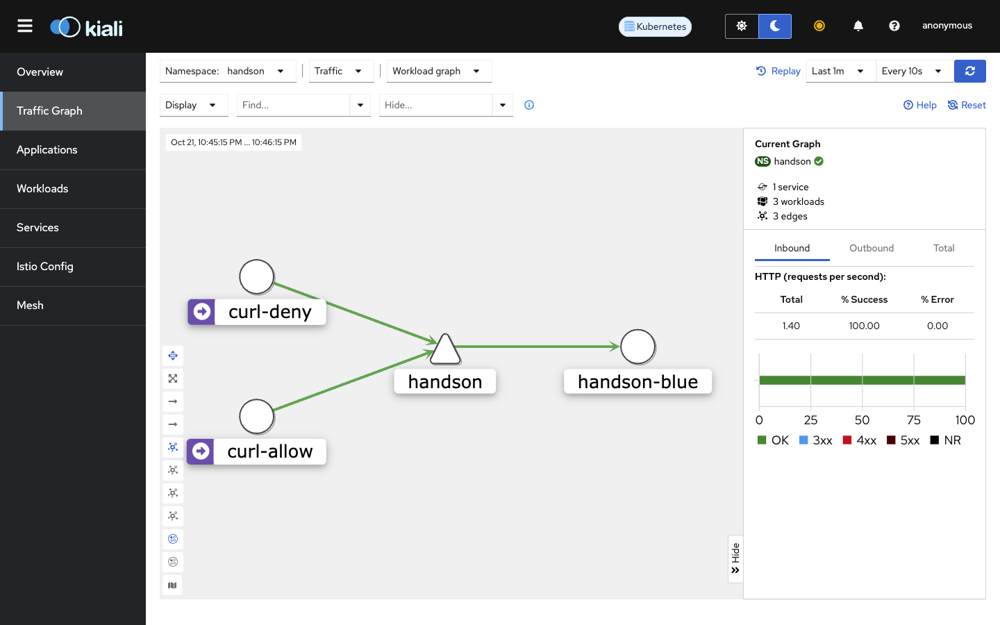

確認ができたら、リクエストをいったん停止してください。

#### Istio Authorization Policy適用
それでは、Istio Authorization Policyを作成して、`curl-deny` ワークロードからのport 8080宛に対するリクエストを拒否する設定を追加します。
```sh
kubectl apply -f networking/L4-authorization-policy.yaml
```

作成されるリソースは下記の通りです。
```sh
kubectl get authorizationpolicies -n handson -l content=layer4-authz
```
```sh
# 実行結果
NAME           AGE
layer4-authz   27s
```

再度リクエストをします。
```sh
while :; do
kubectl exec curl-allow -n handson -- /bin/sh -c "echo -n 'curl-allow: ';curl -s -o /dev/null -w '%{http_code}\n' handson:8080";
kubectl exec curl-deny -n handson -- /bin/sh -c "echo -n 'curl-deny:  ';curl -s -o /dev/null -w '%{http_code}\n' handson:8080";
echo ----------------;sleep 1;
done
```

しばらくすると、`curl-deny` ワークロードからのリクエストは拒否されるようになります。

```sh
# 出力結果例
curl-allow: 200
curl-deny:  200
----------------
curl-allow: 200
curl-deny:  200
----------------
curl-allow: 200
curl-deny:  403
----------------
curl-allow: 200
curl-deny:  403
----------------
.
.
.
```

改めてKiali dashboardから確認してみましょう。ブラウザから<http://kiali.vm17.handson.cloudnativedays.jp>にアクセスをしてください。しばらくすると、`curl-allow` ワークロードからのリクエストは許可されている一方で、`curl-deny` ワークロードからのリクエストは拒否されていることが確認できます(変化が見られない場合は、Kialiダッシュボード右上の青い`Refresh`ボタンを押して状態を更新してください)。

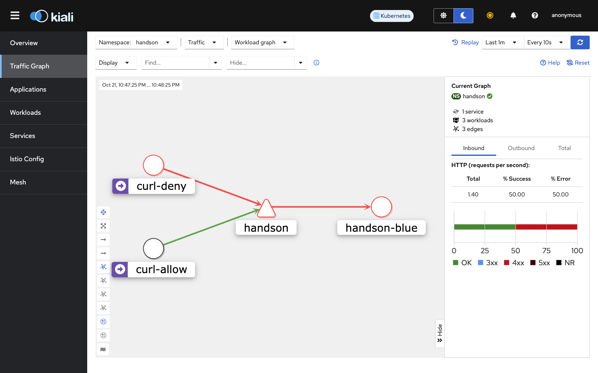

確認ができたら、リクエストを停止してください。

Istio Authorization Policyを使用して、Istioメッシュ内のL4レベルのアクセス管理を実装しました。Istioの機能を利用することで、アプリケーション側にロジックを追加することなくL4レベルのアクセス管理を実現できます。

#### クリーンアップ
```sh
kubectl delete -f networking/L4-authorization-policy.yaml
kubectl delete -f app/curl-allow.yaml,app/curl-deny.yaml
```

### L7アクセス管理
Istio Authorization Policyを用いてL7レベルのアクセス管理を実装します。Istioメッシュ内において、あるワークロードに対して特定のワークロードからのL7レベルでのアクセスを制御したい時がユースケースとして挙げられます。本ケースでは`handson-blue`ワークロードにアクセスをするワークロードを1つ用意し、GETメソッドのみ許可(削除、更新系のメソッドは拒否)をするケースを想定します。

[セットアップ](#セットアップ)が完了していることを前提とします。

#### 追加アプリケーションdeploy
現在動作中のアプリケーションは下記のとおりです。
```sh
kubectl get pods -n handson -l app=handson
```
```sh
# 実行結果
NAME                            READY   STATUS    RESTARTS   AGE
handson-blue-6bdf8c8b6d-xhqkq   2/2     Running   0          21m
```

`handson-blue`ワークロードにアクセスするワークロードをdeployします。
```sh
kubectl apply -f app/curl.yaml
```

作成されるリソースは下記のとおりです。
```sh
kubectl get pods -n handson -l content=layer7-authz
```
```sh
# 実行結果
NAME   READY   STATUS    RESTARTS   AGE
curl   2/2     Running   0          24s
```

それでは、`curl` ワークロードから`handson-blue`ワークロードに対してリクエストをします。
```sh
while :; do kubectl exec curl -n handson -- curl -s -o /dev/null -w '%{http_code}\n' handson:8080;sleep 1;done
```

リクエストが成功していることを確認してください。
```sh
# 出力結果
200
200
200
.
.
.
```

Kiali dashboardからも確認してみましょう。リクエストを流した状態でブラウザから<http://kiali.vm17.handson.cloudnativedays.jp>にアクセスをしてください。`curl` ワークロードから`handson-blue`ワークロードにアクセスできていることが確認できます(なかなか表示されない場合は、Kialiダッシュボード右上の青い`Refresh`ボタンを押して状態を更新してください)。

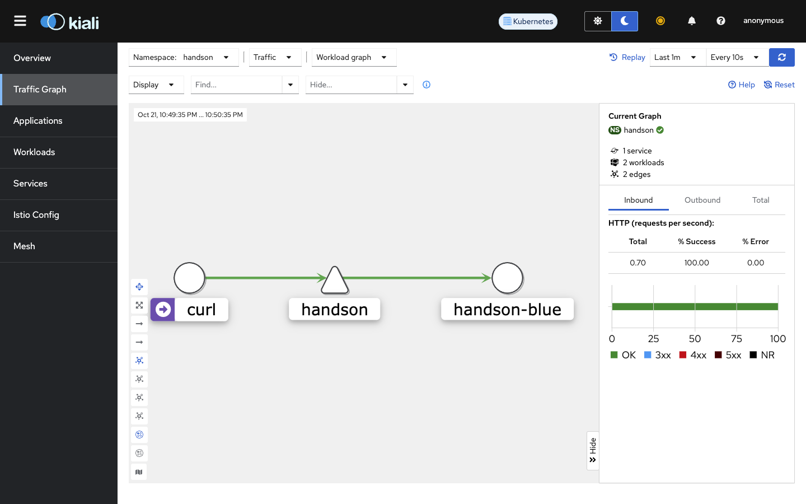

確認ができたら、リクエストをいったん停止してください。

#### Istio Authorization Policy適用
それでは、Istio Authorization Policyを適用して、`curl` ワークロードからのGETリクエストのみを許可し、削除、更新系のメソッドを拒否します。
```sh
kubectl apply -f networking/L7-authorization-policy.yaml
```

作成されたリソースは下記の通りです。
```sh
kubectl get authorizationpolicies -n handson -l content=layer7-authz
```
```sh
# 実行結果
NAME           AGE
layer7-authz   2m24s
```

まずは確認のためにGETリクエストをします(明示的にGETを指定しています)。
```sh
while :; do kubectl exec curl -n handson -- curl -s -X GET -o /dev/null -w '%{http_code}\n' handson:8080;sleep 1;done
```

先ほどと同じく、リクエストが成功していることを確認してください。
```sh
# 出力結果
200
200
200
.
.
.
```

リクエストをいったん停止してください。

それでは、POSTメソッドでリクエストをしてみましょう。`handson-blue`ワークロードにPOSTメソッドは実装されていないので、空データを使用します。
```sh
while :; do kubectl exec curl -n handson -- curl -X POST -s -o /dev/null -d '{}' -w '%{http_code}\n' handson:8080;sleep 1;done
```

しばらくすると、403にて拒否されるようになります。
```sh
# 実行結果
200
200
403
403
403
.
.
.
```

Kiali dashboardから確認してみましょう。ブラウザから<http://kiali.vm17.handson.cloudnativedays.jp>にアクセスをしてください。しばらくすると、`curl` ワークロードからのPOSTリクエストは拒否されていることが確認できます(変化が見られない場合は、Kialiダッシュボード右上の青い`Refresh`ボタンを押して状態を更新してください)。

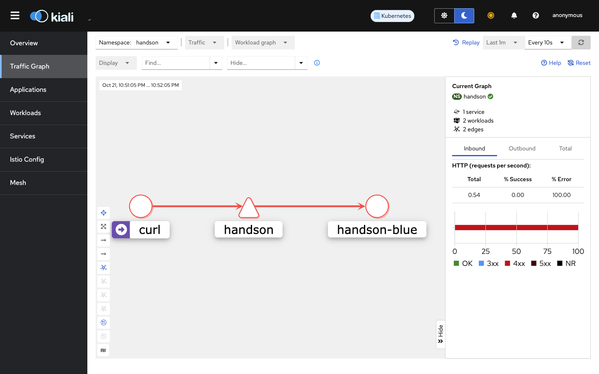

確認ができたらリクエストを停止してください。

最後にDELETEメソッドも期待通り拒否されるか確認してみましょう。`handson-blue`ワークロードにDELETEメソッドは実装されていないので、dummy IDを削除することとします。
```sh
while :; do kubectl exec curl -n handson -- curl -X DELETE -s -o /dev/null -w '%{http_code}\n' handson:8080/id/123;sleep 1;done
```

こちらも、403にて拒否されることを確認してください。
```sh
# 実行結果
403
403
403
.
.
.
```
確認ができたらリクエストを停止してください。

Istio Authorization Policyを使用して、Istioメッシュ内のL7レベルのアクセス管理を実装しました。Istioの機能を利用することで、アプリケーション側にロジックを追加することなく、L7レベルのアクセス管理を実現できます。

#### クリーンアップ
```sh
kubectl delete -f networking/L7-authorization-policy.yaml
kubectl delete -f app/curl.yaml
```

## まとめ
サービスメッシュを提供するIstioを使用することで、アプリケーションレイヤーではなくインフラレイヤーでサービス間のトラフィック管理を、またKialiを使用することでサービスメッシュの可視化をできます。本chapterではVirtual Service, Destination Ruleを使用したルーティング制御、Authorization Policyを使用した認可処理しか紹介していませんが、Istioには他にも[沢山の機能](https://istio.io/latest/docs/tasks/)がありますので、是非確認してみてください。

## 最終クリーンアップ
`handson` namespaceをIstioサービスメッシュの管理外にします。
```sh
kubectl label namespace handson istio-injection-
```
ラベルが取り除かれたことを確認してください。
```sh
kubectl get namespace handson --show-labels
```
```sh
# 実行結果
NAME      STATUS   AGE    LABELS
handson   Active   152m   kubernetes.io/metadata.name=handson
```
`handson-blue`ワークロードを再起動して現在動作中のenvoyコンテナを削除します。
```sh
kubectl rollout restart deployment/handson-blue -n handson
```
`handson-blue` podのコンテナが1つだけになっていることを確認してください。
```sh
kubectl get pods -l app=handson -n handson
```
```sh
# 実行結果
NAME                            READY   STATUS    RESTARTS   AGE
handson-blue-5bc85b4d98-z7lcz   1/1     Running   0          71s
```
