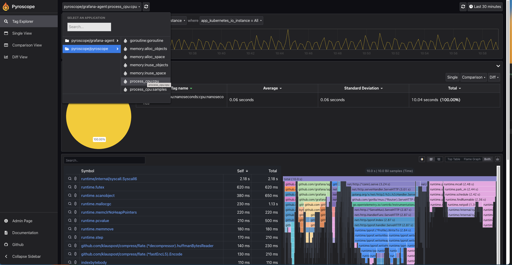

# Pyroscope
この章では、オブザーバビリティの主要シグナルとして注目される、プロファイルについて紹介し、オブザーバビリティのバックエンドとして、GrafanaLabsのPyroscopeを導入します。

## プロファイルについて
**プロファイル**とは、ツールによりプログラム実行時の各種データを収集し、得られたデータの統計的な要約を行うことです。あるいは、そのデータのこともプロファイルと呼びます。また、プロファイルを収集する行為のことを、**プロファイリング**と呼びます。

メトリクスとは異なる概念で、アプリケーションがリソースをどのように消費しているかを断面的に見ることができ、リソース消費の多いプログラムを、即座に特定すること等に役立ちます。

オブザーバビリティにおける主要シグナルとして、ログ、メトリクス、トレースが挙げられ、「3本柱」とも呼ばれがちですが、プロファイルでしか表せない表現もあるため、ぜひ注目してほしい言葉です。

## 従来のプロファイリング（非連続）と継続的プロファイリング
実は、プロファイルは開発者にとって、既に馴染みあるものかもしれません。
Google Chromeから、下記の手順で、プロファイルを取得することができます。

### 実践：従来のプロファイリング（非連続）
1. Chrome DevToolsを開く:
Google Chromeを開き、任意のWebページを表示します。次に、該当ページ上で右クリックし、「検証」を選択します。または、キーボードショートカットでDevToolsを開くこともできます（Windows/LinuxではCtrl+Shift+I、MacではCmd+Opt+I）。
2. Performanceタブを選択:
DevToolsが開いたら、上部のタブから「Performance」（パフォーマンス）タブを選択します。
3. パフォーマンスプロファイリングの開始:
Performanceタブが開いたら、左上の再生ボタン（▶︎）をクリックしてパフォーマンスプロファイリングを開始します。
4. 操作を実行:
プロファイリングを開始したら、何かしらの操作をします。実際には、アプリケーションで性能の問題が発生する可能性が高い操作を実行します。
5. プロファイリングを停止:
操作が終了したら、プロファイリングを停止します。左上の停止ボタン（■）をクリックします。


* 期待する結果：何かしらのプロファイルが収集され、画面に表示されること

しかし、この従来のプロファイリングは、アプリケーションにオーバヘッドがかかるため、従来のプロファイリングの実行は、開発環境だけに限定された過去もありました。
また、プロファイルを作るためには、アプリケーションの操作について、記録の開始宣言し、停止した後にデータの分析をする仕組みのため、非連続的なプロファイリングしかできません。

このプロファイリングを、運用環境でも実行可能にし、長期間のプロファイルを収集できるようアプローチしたものが、**継続的プロファイリング**です。
継続的プロファイリングでは、オーバヘッドの低いサンプリングを使用して、プロファイルを安全に収集します。そのプロファイルはデータベースに保存するため、後で分析することができます。

継続的プロファイリングを使用すると、分散サービス化しているアプリケーションが、本番環境でどのように動作するかを、全体的に把握することにも役立ちます。


## Pyroscopeについて


**Pyroscope**は、Grafana Labsにより展開されている、継続的プロファイリングのOSS製品です。

元々、Grafana Phlare というプロジェクトがありましたが、2023/3 に、Grafana LabsがPyroscope社を買収し、Grafana Phlare と Pyroscope が統合され「Grafana Pyroscope」となりました。
2023/9 に v1.0.0 がリリースされています。

## Pyroscopeのアーキテクチャ（サーバー）
Pyroscopeのアーキテクチャを説明します。後述するdistributorやingester等、Pyrocopeのアーキテクチャは、LokiやMimirなどのGrafanaLabsスタックでも用いられるので、知っておくと良いでしょう。

### Write（プロファイルの書き込み）


1. distributorは、ingesterへプロファイルをPushします。
2. ingesterは、受信したプロファイルを、Pyroscopeのデータベースに保存します。プロファイルをすぐに書き込むのでなく、一度ingesterのメモリ領域か、ingesterのディスク領域に保持します。最終的に、全てのプロファイルがディスクに書き込まれ、長期ストレージに追加されます。ingesterはレプリケートされており、デフォルトでは3つのingesterが動いてます。
3. Compactorは、各ingesterからのブロックを1つにマージし、重複部分を削除します。ブロック圧縮により、ストレージ使用率を大幅に削減します。


### Read（プロファイルの読み込み）


1. Pyroscope上で実行されたクエリはAPIリクエストとして、query-frontendで受け取ります。
2. query-frontendは、query-schedulerに通信しに行きます。query-schedulerはクエリのキューを維持し、各テナントが公平に実行されるようにします。
3. querierは、query-schedulerのキューから、クエリを取得します。
4. querierの参照先は、最近のデータからならingesterから、長期ストレージからならstore-gatewayからデータを取得します。

## Pyroscopeへのプロファイルの送信（クライアント）
プロファイルをPyroscopeに送信する場合、各言語ごとのPyroscope SDKを使うか、Grafana Agentを使うかの2択となります。しかし、2024/04にGrafana Alloyという、OpenTelemetry Collector互換の新たなOSSが発表されました。Grafana Agentは2025年にEOLとなり、Alloyへとプロジェクト移行されます。

当ハンズオンでは、初期構築時にGrafana Agentがインストールされています。

## 実践: Grafana Pyroscopeのインストール
実践として、Pyroscopeをインストールします。以降のハンズオンででは、pyroscopeのchapterを作業ディレクトリとしてください。
```bash
cd chapter_pyroscope
```

Kubernetesクラスタ上にPyroscopeをインストールします。
ここでは、grafanaのHelm Chartから利用します。

Pyroscopeでは、モノリシックモードと、マイクロサービスモードという、2つのデプロイ方式が選択できます。ここでは、モノリシックモードで動かしてみます。

用意されているhelmfile.yamlおよびvalues.yamlを利用して、 `helmfile sync` を実行し、Pyroscopeをインストールしましょう。

```bash
helmfile sync -f helm/helmfile.yaml
```

実際に各種サービスが起動しているか確認します。

```bash
kubectl get pods -n monitoring -l app.kubernetes.io/instance=pyroscope
```

```bash
# 実行結果
NAME                READY   STATUS    RESTARTS   AGE
pyroscope-0         1/1     Running   0          69s
pyroscope-agent-0   2/2     Running   0          69s
```


## Pyroscopeフロントエンドへのアクセス
Pyoscopeの画面にアクセスします。pyroscopeの画面を参照するために、ingressリソースを追加します。

```bash
kubectl apply -f ingress.yaml
```

[http://pyroscope.vm13.handson.cloudnativedays.jp](http://pyroscope.vm13.handson.cloudnativedays.jp)にアクセスしましょう。既に、Pyroscope自身のプロファイルが確認できます。




## Grafanaへのデータソース追加
chapter_grafanaで構築したGrafanaに、Pyroscopeのデータソースを追加します。
* Data sourse：Grafana Pyroscope
* HTTP>URL：http://pyroscope.monitoring.svc.cluster.local:4040


※kube-prometheus-stackで使用したhelmのvaluesに追加する手順でも対応できます。
```helmのvalues.yaml
datasources:
  - name: Grafana Pyroscope
    type: grafana-pyroscope-datasource
    url: http://pyroscope.monitoring.svc.cluster.local:4040
```

## Grafanaからのプロファイル参照
GrafanaのExplore([http://grafana.vm13.handson.cloudnativedays.jp/explore](http://grafana.vm13.handson.cloudnativedays.jp/explore))からプロファイルを見てみましょう。GarafanaのExploreでは、プロファイルタイプの選択と、ラベルセレクターでの絞り込みで、容易に表示できます。

プロファイルタイプは、cpu、memory、goroutineなどがあり、各言語ごとにサポートされています。詳細は、[Pyroscopeのドキュメント](https://grafana.com/docs/pyroscope/latest/view-and-analyze-profile-data/profiling-types/#available-profiling-types)を参照ください。

ラベルセレクターは、対象をtagで絞りたい場合に有効です。これは、Pyroscopeのclient側で付与されたtagになります。helmでinstallしたgrafana-agentでは、自動計装として使用可能なtagが付与されています。（[Pyroscope](http://pyroscope.vm13.handson.cloudnativedays.jp)のSingle View>Select Tagでの確認が簡単です。）空欄のままでもプロファイルを参照可能です。


1. プロファイルタイプを選択します。試しに、`process_cpu-cpu`を選択します。


2. ラベルセレクターで、対象を絞り込みます。記法は`{<tag>=<value>}`です。 試しに、`{app_kubernetes_io_instance="pyroscope"}`を入力します。


3. 「Run query」を実行して、プロファイルを表示します。


4. メトリクスも同時に表示することができます。「Options」で表示項目を増やし、「Query Type」を「Both」にします。


5. 再度、「Run query」を実行すれば、メトリクスとプロファイルを同時に表示することができます。（※「Query Type」を「Metric」にすれば、メトリクスだけ表示します）


## まとめ
当ハンズオンでは、プロファイルとは何かという原理・原則的な話から、実際にGrafanaLabsのPyroscopeを使ったプロファイリングの実装を、手短に説明してみました。プロファイルは、アプリケーションのどのプログラムがパフォーマンスに影響しているかを、一発で見つけることに貢献します。また、メトリクスはもちろん、トレース、ログとの紐付けなども期待できますので、ぜひ実装にチャレンジしてみて下さい。

## 番外編：マイクロサービスモードで動かしたいとき
マイクロサービスモードで動かしたい場合、helmのvaluesを宣言した状態で、`helmfile sync`を再実行してみてください。
マイクロサービスモードでは、ストレージサービスの指定が必要で、ここではMinIOというオブジェクトストレージサーバが採用されます。

ハンズオン用では、[values-micro-services.yaml](https://raw.githubusercontent.com/grafana/pyroscope/main/operations/pyroscope/helm/pyroscope/values-micro-services.yaml)を元に、要求リソースを小さくして作成しています。

vim等で、下記の通りvalueのコメントアウトをはずします。
```helmfile.yaml
releases:
- name: pyroscope
  namespace: pyroscope
  createNamespace: true
  chart: grafana/pyroscope
  version: 1.5.0
  values:
  - values-micro-services.yaml # マイクロサービスモードを使用する場合使用
```

`helmfile sync`を再実行します。

```bash
helmfile sync -f helm/helmfile.yaml
```

マイクロサービスモードで動いているか確認します。

```bash
kubectl get pods -n monitoring -l app.kubernetes.io/instance=pyroscope
```

```bash
# 実行結果
NAME                                         READY   STATUS    RESTARTS   AGE
pyroscope-agent-0                            2/2     Running   0          33s
pyroscope-compactor-0                        1/1     Running   0          33s
pyroscope-compactor-1                        1/1     Running   0          33s
pyroscope-distributor-65cc858cb6-6mjq2       1/1     Running   0          33s
pyroscope-ingester-0                         1/1     Running   0          33s
pyroscope-ingester-1                         1/1     Running   0          33s
pyroscope-minio-0                            0/1     Pending   0          33s
pyroscope-minio-make-bucket-job-vlmhb        1/1     Running   0          33s
pyroscope-querier-85855c9c5d-88dkj           1/1     Running   0          33s
pyroscope-querier-85855c9c5d-cggfp           1/1     Running   0          33s
pyroscope-querier-85855c9c5d-mt99w           1/1     Running   0          33s
pyroscope-query-frontend-7b55fbf7f6-2cz8p    1/1     Running   0          33s
pyroscope-query-scheduler-7497dd4996-v56z7   1/1     Running   0          33s
pyroscope-store-gateway-0                    0/1     Running   0          33s
pyroscope-store-gateway-1                    0/1     Running   0          33s
```

マイクロサービスモードの場合、Grafanaのデータソースも、接続先をquery-frontendにする必要があります。下記に変更してください。

* HTTP>URL：http://pyroscope-query-frontend.monitoring.svc.cluster.local:4040

## 参考文献

- [Pyroscopeの公式ドキュメント](https://grafana.com/docs/pyroscope/latest/)
- [What is continuous profiling, and what is Pyroscope?](https://isitobservable.io/open-telemetry/what-is-continuous-profiling-and-what-is-pyroscope)
